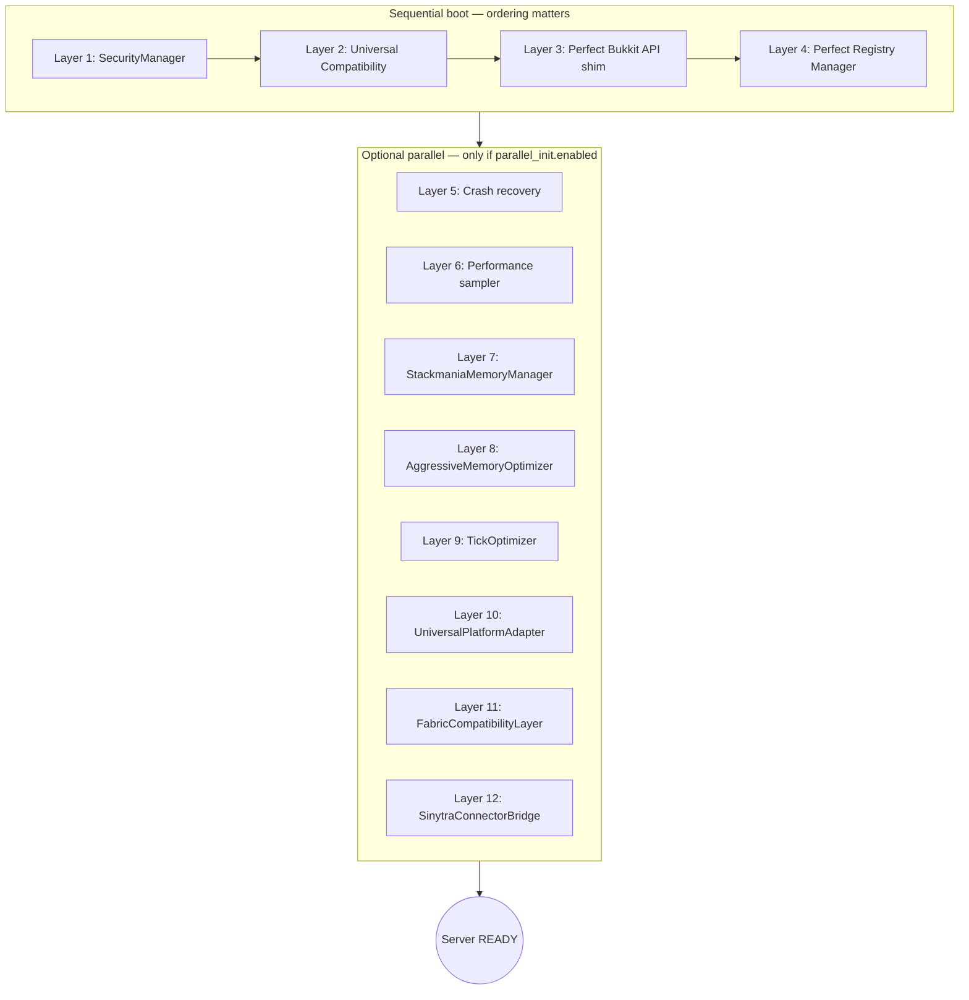

<div align="center">

# Stackmania

**A maintenance-oriented fork of Mohist 1.20.1 by [Lorenz0FF](https://github.com/Lorenz0FF) / Valonia Games.**

[](docs/BENCHMARKS.md)
[](LICENSE)
[](https://github.com/Lorenz0FF/Stackmania/releases/latest)
[](https://minecraft.net)
[](https://files.minecraftforge.net/net/minecraftforge/forge/index_1.20.1.html)
[](https://adoptium.net/)

</div>

> ⚠️ **Status: Beta** — modules ship enabled by default but their measured impact is partial. See [BENCHMARKS.md](docs/BENCHMARKS.md) for current data and the protocol used to collect it.

---

## What this fork actually is

Stackmania tracks [MohistMC/Mohist](https://github.com/MohistMC/Mohist) for Minecraft 1.20.1 and layers on a small set of opinionated changes that are tuned for the maintainer's own server ([The Walking Craft](https://github.com/Lorenz0FF)).

It is **not** a marketing project. It does not claim to be the world's first anything. It does not promise zero crashes, perfect compatibility, or a fixed percentage RAM saving — those are claims that require a published benchmark, and the bench data for 1.1.x is still being collected.

If you are looking for a more battle-tested upstream, use [Mohist](https://github.com/MohistMC/Mohist) directly. If you want to follow along while a single maintainer experiments with opt-in performance levers and hardens the boot path, you are in the right place.

---

## What this fork actually adds

Compared to vanilla Mohist 1.20.1, this fork ships:

### Custom Java code (26 classes under `src/main/java/com/stackmania/`)

| Package | Classes | Role |
|---|---|---|
| `core/` | 3 | `StackmaniaCore` mod entry, `StackmaniaConfig` loader, `StackmaniaVersion` build metadata |
| `crash/` | 4 | Predictive crash logging, isolated execution contexts, state checkpointing |
| `memory/` | 3 | Aggressive GC tuning, per-tick memory manager, `/stackmania memory` command |
| `compatibility/` | 8 | Universal compatibility layer, conflict DB, Fabric / Sinytra / NeoForge bridges |
| `performance/` | 1 | Per-tick performance sampler |
| `registry/` | 2 | Safe and perfect registry managers (cleanup on mod removal) |
| `material/` | 1 | Material cache (prevents Bukkit double-injection) |
| `optimization/` | 1 | `StackmaniaTickOptimizer` |
| `bukkit/` | 1 | `PerfectBukkitAPI` shim layer |
| `security/` | 1 | `StackmaniaSecurityManager` (boots first, hardens classloader) |
| `player/` | 1 | `PersistentPlayerManager` (Player object survives respawn) |

> Each class is real and reachable from the boot path. Whether it measurably moves a metric on your workload is a separate question — see BENCHMARKS.md.

### Three opt-in perf features (default OFF)

These ship disabled because they have user-visible side effects and need per-server tuning:

- **`mob_cap.enabled`** — per-chunk mob cap distributor (instead of the vanilla per-world cap)
- **`dynamic_view_distance.enabled`** — drops global view distance under TPS pressure (per-player is *not* available; see Known limitations)
- **`parallel_init.enabled`** — runs Stackmania layers 5-12 boot in parallel. Layers 1-4 stay sequential because security/registry/material/player have ordering constraints.

### A bench harness

`/stackmania bench dump` writes a JSON snapshot of TPS, RAM, GC pauses, per-module init cost and per-module sample counts to `stackmania-config/bench/<timestamp>.json`. Used to drive the matrix described in BENCHMARKS.md.

### Fixes shipped in 1.1.x

- PAPI (PlaceholderAPI) classloader init — fixed in 1.1.2 (`MohistMC.classLoader` initialized at class-load time + defensive guard)
- Regenerated Forge tick patches against 47.4.13 (1.1.0)
- ModernFix race trace silencer at boot (1.1.0) — see Known limitations
- Internal plugin.yml rebranded `mohist` → `stackmania` to stop name collisions when both jars are on the classpath (1.1.x)
- ForgeGradle pinned to `6.0.47` — bumping it has historically broken the build; do not bump without re-benching (see CONTRIBUTING.md)

---

## Architecture overview



Layers 1-4 run sequentially because each one mutates state the next one reads (security must install the classloader before registry can scan it, etc.). Layers 5-12 are independent and can run in parallel via a fixed thread pool — but the feature is **off by default** because parallel init reorders log lines and has caught race conditions twice in 1.1.x.

For the full init order, dependency rules, and the `Config.init()` rule that every module must obey, see [docs/ARCHITECTURE.md](docs/ARCHITECTURE.md).

---

## Quick start

```bash
# Download stackmania-1.20.1-server.jar from
#   https://github.com/Lorenz0FF/Stackmania/releases/latest
java -Xms4G -Xmx6G -jar stackmania-1.20.1-server.jar
```

On first boot, edit `stackmania-config/stackmania.yml` to enable or disable individual modules.

### For Fabric mod support

Fabric is **not native** in this fork. Drop these into `/mods/` alongside your Forge mods:

- [Sinytra Connector](https://github.com/Sinytra/Connector/releases)
- [Forgified Fabric API](https://github.com/Sinytra/ForgifiedFabricAPI/releases)

Any Fabric mod that isn't supported by Connector will not load. Stackmania's `sinytra_bridge` module smooths a few rough edges in the boot path, it does not extend Connector's coverage.

### Recommended JVM flags

```bash
java -Xms4G -Xmx6G \
  -XX:+UseG1GC \
  -XX:MaxGCPauseMillis=50 \
  -XX:+ParallelRefProcEnabled \
  -XX:+AlwaysPreTouch \
  -XX:G1HeapRegionSize=16M \
  -XX:+UnlockExperimentalVMOptions \
  -XX:+DisableExplicitGC \
  -jar stackmania-1.20.1-server.jar
```

ZGC is also viable on Java 17 + large heaps but has not been benched on this fork — feedback welcome.

---

## Configuration

`stackmania-config/stackmania.yml` ships with sensible defaults. The 14 togglable modules:

```yaml
modules:
  tick_optimizer:           { enabled: true }
  aggressive_memory:        { enabled: true }
  crash_recovery:           { enabled: true }
  security:                 { enabled: true }
  mod_loader_bridge:        { enabled: true }
  material_cache:           { enabled: true }
  persistent_player:        { enabled: true }
  bukkit_bridge:            { enabled: true }
  perfect_registry:         { enabled: true }
  performance_monitor:      { enabled: true }
  stackmania_memory:        { enabled: true }
  universal_platform_adapter: { enabled: true }
  fabric_compatibility:     { enabled: true }
  sinytra_bridge:           { enabled: true }

# Opt-in perf features — default OFF, see README + BENCHMARKS.md before flipping
mob_cap:               { enabled: false }
dynamic_view_distance: { enabled: false }
parallel_init:         { enabled: false }
```

The expected migration path for 1.2.0 is: bench the matrix described in BENCHMARKS.md, then either keep, soft-deprecate, or delete modules whose impact does not justify their maintenance cost.

---

## Building from source

See [docs/CONTRIBUTING.md](docs/CONTRIBUTING.md) for the full build env. TL;DR:

```bash
git clone https://github.com/Lorenz0FF/Stackmania.git
cd Stackmania
./gradlew setup packageLibraries stackmaniaJar
# Output: projects/stackmania/build/libs/stackmania-1.20.1-server.jar
```

JDK 17 (Temurin) only. **ForgeGradle is pinned to 6.0.47** — do not bump without reading CONTRIBUTING.md first.

---

## Known limitations

- **Per-player view distance is not supported.** Bukkit 1.20.1 lacks the API; `dynamic_view_distance` is global-only.
- **Fabric mods load only through Sinytra Connector**, which has its own incompatibility list. This fork does not ship a native Fabric loader.
- **A ModernFix race trace may appear once at boot.** It is silenced from log output by default (1.1.0); the underlying race is upstream's. If you see it, it does not indicate corruption.
- **`parallel_init` reorders log lines** and is opt-in for that reason. Enable it only after you've run a vanilla-config boot and confirmed nothing else complains.
- **Sponge API is not supported.** Earlier README versions claimed it was — that was wishful thinking, the code never landed.
- **The 12-layer architecture in this README is the intended/design model.** The actual `StackmaniaCore` constructor today initializes 4 of these layers directly; the others are wired up by their own static `initialize()` calls from elsewhere in the boot path. See ARCHITECTURE.md for the real wiring.

---

## Migrating from another hybrid

See [docs/MIGRATION.md](docs/MIGRATION.md). Short version:

- **From Mohist**: back up `mohist-config/`, drop the new jar, let it generate `stackmania-config/`. Most settings are not auto-ported — copy them across by hand.
- **From Arclight / Magma**: expect to re-test every plugin. The Forge versions differ.

---

## Documentation

- [docs/ARCHITECTURE.md](docs/ARCHITECTURE.md) — layer init order, dependencies, parallel boot constraints
- [docs/BENCHMARKS.md](docs/BENCHMARKS.md) — bench protocol + results table (in progress)
- [docs/MIGRATION.md](docs/MIGRATION.md) — migration from Mohist / Arclight / Magma
- [docs/CONTRIBUTING.md](docs/CONTRIBUTING.md) — build env, ForgeGradle pin, module template, commit style

Older docs in the repo root (`STACKMANIA_ARCHITECTURE.md`, `STACKMANIA_VS_COMPETITION.md`) predate this rewrite and are kept for history only.

---

## Contributing

Issues and PRs are welcome. This is a solo-maintained fork — please read [docs/CONTRIBUTING.md](docs/CONTRIBUTING.md) before opening a PR. For perf regressions, use the [Perf regression](https://github.com/Lorenz0FF/Stackmania/issues/new?template=perf-regression.md) issue template.

---

## Credits

- [Mohist](https://github.com/MohistMC/Mohist) — the upstream this fork tracks
- [MinecraftForge](https://github.com/MinecraftForge/MinecraftForge), [Bukkit / CraftBukkit / Spigot](https://hub.spigotmc.org/), [Paper](https://github.com/PaperMC/Paper), [Sinytra Connector](https://github.com/Sinytra/Connector)

---

## License

GPL-3.0. See [LICENSE](LICENSE).
