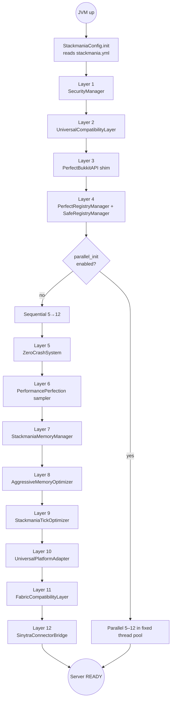

# Stackmania Architecture

> The 12-layer model is the **intended** boot architecture. As of 1.1.2, layers 1–4 are wired directly from `StackmaniaCore`'s constructor; layers 5–12 are initialized from their own entry points (FML lifecycle events, plugin onEnable, etc.). The 1.2.0 release is the first that aims to unify everything under a single coordinator. This document describes the target.

---

## Layer model



---

## Boot order — why it is what it is

| Layer | Class | Why it ships here |
|---|---|---|
| 0 (precondition) | `StackmaniaConfig` | **Must be called before any module.** Every module's `initialize()` calls `StackmaniaConfig.isEnabled("foo")`. If config is not loaded yet you get NPEs or silent default-true behavior. |
| 1 | `StackmaniaSecurityManager` | **Must be first.** Installs the security policy and the classloader hardening hooks. Anything that runs before it can bypass plugin source validation. |
| 2 | `UniversalCompatibilityLayer` + `ConflictDatabase` | Resolves Forge↔Bukkit event-name and class-name conflicts before the registry starts populating. If the registry sees a duplicate ResourceLocation before the conflict DB is loaded, recovery requires a level.dat rollback. |
| 3 | `PerfectBukkitAPI` (shim) | Installs the Paper-compat shims (`getPluginMeta` etc.) before any plugin can call into them. Plugins that lazy-resolve these methods on first call will trigger NoSuchMethodError if the shim is not installed yet. |
| 4 | `PerfectRegistryManager` + `SafeRegistryManager` | Sets up snapshot-and-rollback for the mod registry. Must run before any mod's `RegisterEvent` fires — i.e. before FMLCommonSetupEvent. |
| 5 | `ZeroCrashSystem` (`crash/`) | Predictive crash logger + isolated execution contexts + state checkpointer. Hooks `Thread.setDefaultUncaughtExceptionHandler` — must run before any worker pool is created. |
| 6 | `PerformancePerfection` | Per-tick sampler. Reads MSPT/TPS from the server thread. Cheap to start, can be deferred. |
| 7 | `StackmaniaMemoryManager` | Per-tick memory tracking + leak heuristics. Independent of layer 8. |
| 8 | `AggressiveMemoryOptimizer` | GC tuning + `-XX:+UseG1GC` aware string interning. Independent of layer 7 (no shared state). |
| 9 | `StackmaniaTickOptimizer` | Tick-bucket scheduler. Only matters once the server is past first-tick. |
| 10 | `UniversalPlatformAdapter` | Detects which loaders are present (Forge always; Fabric/NeoForge if classes are on cp). |
| 11 | `FabricCompatibilityLayer` | Best-effort Fabric API surface. Only useful if Sinytra Connector is also on cp. |
| 12 | `SinytraConnectorBridge` | Smooths Connector's boot ordering. Must run last because it depends on layers 10–11 having published their advertised capabilities. |

---

## The `Config.init()` rule

Every Stackmania module begins its `initialize()` method with:

```java
if (!StackmaniaConfig.isLoaded()) {
    StackmaniaConfig.init();   // idempotent, safe to call from multiple modules
}
if (!StackmaniaConfig.isEnabled("module_name")) {
    LOGGER.info("[module_name] disabled in config, skipping init");
    return;
}
```

This guarantees:

1. **No order dependency on config loading** between modules — whichever one runs first wins, the rest no-op.
2. **No NPE if `stackmania.yml` is missing** — `init()` writes defaults.
3. **Disabling a module is honored even if its `initialize()` is called by reflection** from a third-party patch.

Modules that skip this pattern have caused at least two boot crashes in 1.1.x. Any new module must include it.

---

## `parallel_init` constraints

When `parallel_init.enabled: true`, layers 5–12 are submitted to a fixed thread pool of `min(8, availableProcessors)` threads. Layers 1–4 stay sequential because:

- **Layer 1 → 2**: the security manager installs the classloader. Layer 2 reads classes through that classloader. Reordering them = `ClassNotFoundException` 100% of the time.
- **Layer 2 → 3**: layer 3's shim methods are called via Bukkit's PluginManager during layer-3 init, and the shim resolves names through layer 2's conflict DB. Race = stale class binding.
- **Layer 3 → 4**: the registry manager reflects on Bukkit's registry classes — which only exist after layer 3 has shimmed them.
- **Layers 5–12 are independent** by design: they communicate only through `StackmaniaConfig` (read-only) and their own static fields. They do not call into each other during init.

If a future module needs to read another module's state during init, it must be assigned a layer number > that module's, and `parallel_init` must be updated to add the explicit dependency edge. **Do not add cross-module reads to layers 5–12 without also updating this document.**

---

## Edge cases & gotchas

### Security manager goes first, no exceptions

Even if you are disabling the security module for a bench run, the **other** modules still expect the JVM to be in the post-security-init state. Disabling it leaves the classloader in vanilla Forge state and a handful of compatibility shims will silently fall back to slow paths. Bench results from `security: { enabled: false }` are not directly comparable to baseline.

### Material cache must observe Bukkit init

`MaterialCacheManager` installs hooks into Bukkit's `Material` enum init. If layer 3 (the shim) hasn't published the right method handles yet, the cache initializes empty and the double-injection guard is a no-op. The fix is to wait until `PluginManager.callEvent(SERVER_LOAD)` before considering the cache live.

### Persistent player manager and the respawn event

`PersistentPlayerManager` swaps the live `Player` reference during `PlayerRespawnEvent`. Plugins that cache the player reference across respawns (Essentials does, LuckPerms does not) need the swapped reference too — this is handled by Bukkit's event bus automatically *as long as* the swap happens before any other plugin's listener for the same event fires. Stackmania registers the listener at priority `LOWEST` for this reason.

### ModernFix race at boot

ModernFix has a known race in its mixin application during the first 200ms of boot. Stackmania silences the log spam (1.1.0) but does not fix the underlying race — it's upstream's. If you bench with ModernFix removed, expect a small startup delta and a different memory profile (see the 2×2 matrix in BENCHMARKS.md).

### Crash recovery and JVM exit hooks

`ZeroCrashSystem` registers an exit hook to dump checkpoint state. If a plugin (or another mod) registers a competing `Runtime.addShutdownHook` and runs `System.exit(0)` from inside it, our hook may not get to dump. Workaround: log a checkpoint on every TPS-drop event so worst-case data loss is one tick of state.

---

## File map

| Path | Purpose |
|---|---|
| `src/main/java/com/stackmania/core/StackmaniaCore.java` | `@Mod("stackmania")` entry. Bootstraps layers 1–4 directly. |
| `src/main/java/com/stackmania/core/StackmaniaConfig.java` | YAML loader for `stackmania-config/stackmania.yml`. |
| `src/main/java/com/stackmania/core/StackmaniaVersion.java` | Build metadata (Forge / Bukkit / Spigot version strings). |
| `src/main/java/com/stackmania/security/StackmaniaSecurityManager.java` | Layer 1. |
| `src/main/java/com/stackmania/compatibility/UniversalCompatibilityLayer.java` | Layer 2 entry. |
| `src/main/java/com/stackmania/compatibility/ConflictDatabase.java` | Conflict DB consumed by layer 2. |
| `src/main/java/com/stackmania/bukkit/PerfectBukkitAPI.java` | Layer 3. |
| `src/main/java/com/stackmania/registry/PerfectRegistryManager.java` | Layer 4a. |
| `src/main/java/com/stackmania/registry/SafeRegistryManager.java` | Layer 4b. |
| `src/main/java/com/stackmania/crash/ZeroCrashSystem.java` | Layer 5 entry. |
| `src/main/java/com/stackmania/crash/CrashPredictor.java` | Crash heuristics for layer 5. |
| `src/main/java/com/stackmania/crash/IsolatedContext.java` | Sandbox for risky callbacks. |
| `src/main/java/com/stackmania/crash/StateManager.java` | Checkpoint dumper. |
| `src/main/java/com/stackmania/performance/PerformancePerfection.java` | Layer 6. |
| `src/main/java/com/stackmania/memory/StackmaniaMemoryManager.java` | Layer 7. |
| `src/main/java/com/stackmania/memory/AggressiveMemoryOptimizer.java` | Layer 8. |
| `src/main/java/com/stackmania/memory/MemoryCommand.java` | `/stackmania memory` command. |
| `src/main/java/com/stackmania/optimization/StackmaniaTickOptimizer.java` | Layer 9. |
| `src/main/java/com/stackmania/compatibility/UniversalPlatformAdapter.java` | Layer 10. |
| `src/main/java/com/stackmania/compatibility/FabricCompatibilityLayer.java` | Layer 11. |
| `src/main/java/com/stackmania/compatibility/SinytraConnectorBridge.java` | Layer 12. |
| `src/main/java/com/stackmania/compatibility/AdapterGenerator.java` | Bytecode adapter generation (used by layer 10). |
| `src/main/java/com/stackmania/compatibility/BytecodeAnalyzer.java` | Analyzer for layer 10. |
| `src/main/java/com/stackmania/compatibility/TranslatorRegistry.java` | API translation registry. |
| `src/main/java/com/stackmania/material/MaterialCacheManager.java` | Bukkit Material cache. |
| `src/main/java/com/stackmania/player/PersistentPlayerManager.java` | Player object persistence across respawn. |

26 classes total — the README sometimes refers to "27 custom classes" because earlier drafts counted `MemoryCommand` as a separate module. It is a command, not a module, so this doc lists 26.

---

## What the 1.2.0 cleanup is meant to do

1. Move all layer init into a single coordinator (`StackmaniaBoot`) so the layer graph is defined in one place and `parallel_init` can be reasoned about without grepping the codebase.
2. Make the `Config.init()` rule un-bypassable by inverting it: the coordinator passes config into each module's `init(StackmaniaConfig cfg)` rather than each module reading the static singleton.
3. Use the bench matrix (BENCHMARKS.md) to delete or soft-deprecate modules whose measured impact does not justify their maintenance cost.
